# Taxonomy Reference

**Enterprise Glossary Management System**

**Version:** 1.0
**Date:** February 2026
**Status:** Active

---

## Overview

The EGMS taxonomy organizes glossary terms into a two-tier hierarchy of **concepts**. This document is the living reference for how the glossary is structured, what each concept covers, and how to extend the taxonomy with new verticals.

### Two Types of Top-Level Concepts

| Type | Description | Examples |
|------|-------------|---------|
| **Core** | Universal terms applicable across all industry verticals | Engineering, Business, Infrastructure, Process |
| **Vertical** | Industry-specific terminology for client verticals Symphony Core serves | Real Estate, Legal, Accounting, Healthcare, Home Services |

Core concepts exist today and contain the bulk of terms. Vertical concepts are added as the organization expands into new industries. A vertical starts as a **scaffold** (structure only, no terms) and is populated when source vocabulary becomes available.

---

## Hierarchy Diagram

```mermaid
graph LR
    SCHEME["<b>Enterprise Glossary</b><br/>Concept Scheme"]

    %% Core concepts
    SCHEME --> ENG["<b>Engineering</b><br/>(core)"]
    SCHEME --> BUS["<b>Business</b><br/>(core)"]
    SCHEME --> INFRA["<b>Infrastructure</b><br/>(core)"]
    SCHEME --> PROC["<b>Process</b><br/>(core)"]

    %% Vertical concepts
    SCHEME --> RE["<b>Real Estate</b><br/>(vertical)"]
    SCHEME --> LEGAL["<b>Legal</b><br/>(vertical - scaffold)"]
    SCHEME --> ACCT["<b>Accounting</b><br/>(vertical - scaffold)"]
    SCHEME --> HEALTH["<b>Healthcare</b><br/>(vertical - scaffold)"]
    SCHEME --> HOME["<b>Home Services</b><br/>(vertical - scaffold)"]

    %% Engineering mid-level
    ENG --> SD["Software Development<br/>~51 terms"]
    ENG --> AIML["AI & Machine Learning<br/>~52 terms"]
    ENG --> DM["Data Management<br/>~68 terms"]
    ENG --> EXIST["(existing 25 terms)<br/>CI/CD, Docker, etc."]

    SD -.- SRC_SD["software-dev-glossary.md"]
    AIML -.- SRC_AI["ai-glossary.md"]
    DM -.- SRC_DM["data-management-glossary.md"]

    %% Business mid-level
    BUS --> MKT["Marketing & SEO<br/>~151 terms"]
    BUS --> STRAT["Strategy & Planning<br/>~77 terms"]
    BUS --> PM["Product Management<br/>~52 terms"]
    BUS --> SVC["Service Design<br/>~42 terms"]

    MKT -.- SRC_MKT["marketing-terms-glossary.md<br/>seo-glossary.md"]
    STRAT -.- SRC_STRAT["business-plan-glossary.md<br/>lean-startup-glossary.md"]
    PM -.- SRC_PM["product-management-glossary.md"]
    SVC -.- SRC_SVC["service-as-product-glossary.md"]

    %% Infrastructure mid-level
    INFRA --> PLAT["Platform Services<br/>(scattered terms)"]

    %% Process mid-level
    PROC --> OPS["Operations<br/>~19 terms"]
    PROC --> SC["SC Internal<br/>~6 terms"]

    OPS -.- SRC_OPS["process-management-glossary.md"]
    SC -.- SRC_SC["sc-approved-terminology.md"]

    %% Real Estate mid-level
    RE --> PROP["Property Management<br/>~40 terms"]
    RE --> LEASE["Leasing & Tenancy<br/>~30 terms"]
    RE --> REVAL["Valuation & Finance<br/>~17 terms"]

    PROP -.- SRC_RE1["retail-property-glossary.md"]
    LEASE -.- SRC_RE2["retail-property-glossary.md"]
    REVAL -.- SRC_RE3["retail-property-glossary.md"]

    %% Legal scaffold
    LEGAL --> LEGAL_BF["Business Formation"]
    LEGAL --> LEGAL_COMP["Compliance"]
    LEGAL --> LEGAL_IP["Intellectual Property"]
    LEGAL --> LEGAL_CONT["Contracts"]

    %% Accounting scaffold
    ACCT --> ACCT_TAX["Tax & Filing"]
    ACCT --> ACCT_BOOK["Bookkeeping"]
    ACCT --> ACCT_FIN["Financial Reporting"]

    %% Healthcare scaffold
    HEALTH --> HEALTH_PRAC["Practice Management"]
    HEALTH --> HEALTH_COMP["HIPAA & Compliance"]
    HEALTH --> HEALTH_BILL["Billing & Coding"]

    %% Home Services scaffold
    HOME --> HOME_TRADE["Trades & Specialties"]
    HOME --> HOME_EST["Estimating & Pricing"]
    HOME --> HOME_LIC["Licensing & Permits"]

    %% Styling
    style SCHEME fill:#1C242B,color:#fff,stroke:#3682AE,stroke-width:3px
    style ENG fill:#3682AE,color:#fff
    style BUS fill:#3682AE,color:#fff
    style INFRA fill:#3682AE,color:#fff
    style PROC fill:#3682AE,color:#fff
    style RE fill:#2d7a5a,color:#fff
    style LEGAL fill:#2d7a5a,color:#fff,stroke-dasharray:5
    style ACCT fill:#2d7a5a,color:#fff,stroke-dasharray:5
    style HEALTH fill:#2d7a5a,color:#fff,stroke-dasharray:5
    style HOME fill:#2d7a5a,color:#fff,stroke-dasharray:5
    style EXIST fill:#4a4a6a,color:#fff
    style LEGAL_BF fill:#e8f5e9,color:#333,stroke-dasharray:5
    style LEGAL_COMP fill:#e8f5e9,color:#333,stroke-dasharray:5
    style LEGAL_IP fill:#e8f5e9,color:#333,stroke-dasharray:5
    style LEGAL_CONT fill:#e8f5e9,color:#333,stroke-dasharray:5
    style ACCT_TAX fill:#e8f5e9,color:#333,stroke-dasharray:5
    style ACCT_BOOK fill:#e8f5e9,color:#333,stroke-dasharray:5
    style ACCT_FIN fill:#e8f5e9,color:#333,stroke-dasharray:5
    style HEALTH_PRAC fill:#e8f5e9,color:#333,stroke-dasharray:5
    style HEALTH_COMP fill:#e8f5e9,color:#333,stroke-dasharray:5
    style HEALTH_BILL fill:#e8f5e9,color:#333,stroke-dasharray:5
    style HOME_TRADE fill:#e8f5e9,color:#333,stroke-dasharray:5
    style HOME_EST fill:#e8f5e9,color:#333,stroke-dasharray:5
    style HOME_LIC fill:#e8f5e9,color:#333,stroke-dasharray:5
    style SRC_SD fill:none,stroke:none,color:#666
    style SRC_AI fill:none,stroke:none,color:#666
    style SRC_DM fill:none,stroke:none,color:#666
    style SRC_MKT fill:none,stroke:none,color:#666
    style SRC_STRAT fill:none,stroke:none,color:#666
    style SRC_PM fill:none,stroke:none,color:#666
    style SRC_SVC fill:none,stroke:none,color:#666
    style SRC_RE1 fill:none,stroke:none,color:#666
    style SRC_RE2 fill:none,stroke:none,color:#666
    style SRC_RE3 fill:none,stroke:none,color:#666
    style SRC_OPS fill:none,stroke:none,color:#666
    style SRC_SC fill:none,stroke:none,color:#666
```



**Legend:**
- **Blue (solid)** -- Core concepts (universal, exist today)
- **Green (solid)** -- Active vertical (Real Estate, ready to import)
- **Green (dashed)** -- Scaffold verticals (structure defined, no terms yet)
- **Light green (dashed)** -- Scaffold mid-level categories (placeholders)
- **Gray** -- Existing 25 sample terms (kept as-is)
- **Dotted lines** -- Source markdown pages

---

## Category Definitions

### Core Concepts

#### Engineering

| Concept | URI Slug | Scope | Source Pages |
|---------|----------|-------|-------------|
| **Engineering** (top) | `engineering` | Software engineering practices, tools, and workflows | - |
| Software Development | `software-development` | Programming languages, frameworks, design patterns, development methodologies | software-dev-glossary.md |
| AI & Machine Learning | `ai-machine-learning` | Artificial intelligence, ML models, NLP, computer vision, data science tooling | ai-glossary.md |
| Data Management | `data-management` | Databases, data pipelines, ETL, data governance, analytics infrastructure | data-management-glossary.md |

#### Business

| Concept | URI Slug | Scope | Source Pages |
|---------|----------|-------|-------------|
| **Business** (top) | `business` | Business operations, metrics, and management | - |
| Marketing & SEO | `marketing-seo` | Digital marketing, search engine optimization, content strategy, advertising | marketing-terms-glossary.md, seo-glossary.md |
| Strategy & Planning | `strategy-planning` | Business planning, lean startup methodology, financial modeling, market analysis | business-plan-glossary.md, lean-startup-glossary.md |
| Product Management | `product-management` | Product lifecycle, roadmapping, user research, feature prioritization | product-management-glossary.md |
| Service Design | `service-design` | Service-as-a-product thinking, service blueprinting, customer experience | service-as-product-glossary.md |

#### Infrastructure

| Concept | URI Slug | Scope | Source Pages |
|---------|----------|-------|-------------|
| **Infrastructure** (top) | `infrastructure` | IT infrastructure, networking, and platform services | - |
| Platform Services | `platform-services` | Cloud platforms, hosting, CDN, DNS, monitoring, DevOps infrastructure | (scattered across pages) |

#### Process

| Concept | URI Slug | Scope | Source Pages |
|---------|----------|-------|-------------|
| **Process** (top) | `process` | Organizational processes, workflows, and operational practices | - |
| Operations | `operations` | Process management, workflow optimization, operational excellence | process-management-glossary.md |
| SC Internal | `sc-internal` | Symphony Core-specific approved terminology and internal conventions | sc-approved-terminology.md |

### Vertical Concepts

#### Real Estate (Active)

| Concept | URI Slug | Scope | Source Pages |
|---------|----------|-------|-------------|
| **Real Estate** (top) | `real-estate` | Real estate industry terminology | - |
| Property Management | `property-management` | Property types, building operations, maintenance, tenant services | retail-property-glossary.md |
| Leasing & Tenancy | `leasing-tenancy` | Lease types, tenant relations, occupancy, rental agreements | retail-property-glossary.md |
| Valuation & Finance | `valuation-finance` | Property valuation, real estate finance, investment metrics, cap rates | retail-property-glossary.md |

#### Legal (Scaffold)

| Concept | URI Slug | Scope |
|---------|----------|-------|
| **Legal** (top) | `legal` | Legal industry terminology |
| Business Formation | `legal-business-formation` | Entity types, incorporation, partnership agreements |
| Compliance | `legal-compliance` | Regulatory compliance, filings, licensing requirements |
| Intellectual Property | `legal-intellectual-property` | Patents, trademarks, copyrights, trade secrets |
| Contracts | `legal-contracts` | Contract types, terms, negotiation, enforcement |

#### Accounting (Scaffold)

| Concept | URI Slug | Scope |
|---------|----------|-------|
| **Accounting** (top) | `accounting` | Accounting and finance terminology |
| Tax & Filing | `accounting-tax-filing` | Tax types, filing requirements, deadlines, deductions |
| Bookkeeping | `accounting-bookkeeping` | Chart of accounts, journal entries, reconciliation |
| Financial Reporting | `accounting-financial-reporting` | Financial statements, GAAP, auditing standards |

#### Healthcare (Scaffold)

| Concept | URI Slug | Scope |
|---------|----------|-------|
| **Healthcare** (top) | `healthcare` | Healthcare industry terminology |
| Practice Management | `healthcare-practice-management` | Scheduling, patient intake, office operations |
| HIPAA & Compliance | `healthcare-hipaa-compliance` | Privacy regulations, security requirements, audit procedures |
| Billing & Coding | `healthcare-billing-coding` | Medical coding (ICD/CPT), insurance billing, claims processing |

#### Home Services (Scaffold)

| Concept | URI Slug | Scope |
|---------|----------|-------|
| **Home Services** (top) | `home-services` | Home services industry terminology |
| Trades & Specialties | `home-services-trades` | HVAC, plumbing, electrical, roofing, landscaping specializations |
| Estimating & Pricing | `home-services-estimating` | Job estimation, pricing models, materials costing |
| Licensing & Permits | `home-services-licensing` | Contractor licensing, building permits, inspection requirements |

---

## Summary

| Branch | Type | Mid-Level Categories | Approx. Terms | Source Pages |
|--------|------|---------------------|---------------|-------------|
| Engineering | Core | 3 + existing | ~196 | 3 pages + existing .ttl |
| Business | Core | 4 | ~322 | 5 pages |
| Infrastructure | Core | 1 | (scattered) | - |
| Process | Core | 2 | ~25 | 2 pages |
| Real Estate | Vertical | 3 | ~87 | 1 page |
| Legal | Vertical | 4 | scaffold only | - |
| Accounting | Vertical | 3 | scaffold only | - |
| Healthcare | Vertical | 3 | scaffold only | - |
| Home Services | Vertical | 3 | scaffold only | - |
| **Total** | | **26 concepts** | **~540 terms** | **12 pages** |

---

## Vertical Scaffolding Pattern

Each new vertical follows the same 7-step pattern. No pipeline code changes are required.

### Steps

1. **Define mid-level categories** -- Choose 3-4 categories that partition the vertical's terminology without overlap.
2. **Add to concept-scheme.ttl** -- Add the top concept with `skos:topConceptOf` and mid-level concepts with `skos:broader`.
3. **Add category mappings** -- Add rows to `data/category-mapping.csv` mapping source category strings to the new concept slugs.
4. **Create or import source pages** -- Write markdown glossary pages following one of the 4 standard formats, or import from external sources.
5. **Run the pipeline** -- `md-to-csv.py` -> `csv-to-skos.py` -> `validate-skos.py` -> `load-data.sh`.
6. **Snapshot** -- Run `scripts/snapshot.sh` with a version bump.
7. **Update this document** -- Add the new vertical's category definitions and update the term counts in the summary table.

### New Vertical Checklist Template

```
## Adding a New Vertical: [Vertical Name]

1. [ ] Define 3-4 mid-level categories with clear, non-overlapping scope boundaries
2. [ ] Add top concept + mid-level concepts to data/concept-scheme.ttl
       - Top concept: skos:topConceptOf eg:enterprise-glossary
       - Mid-level: skos:broader eg:[vertical-slug]
3. [ ] Add category mapping rows to data/category-mapping.csv
4. [ ] Create or import glossary source pages (standard markdown format)
5. [ ] Run pipeline:
       python scripts/md-to-csv.py [source-pages] -o data/[vertical]-terms.csv
       python scripts/csv-to-skos.py data/[vertical]-terms.csv -o data/[vertical]-glossary.ttl
       python scripts/validate-skos.py data/[vertical]-glossary.ttl
       ./scripts/load-data.sh
6. [ ] Take snapshot: ./scripts/snapshot.sh
7. [ ] Update docs/taxonomy-reference.md with new branch and term counts
```

### Turtle Template for a New Vertical

```turtle
# Top concept
eg:[vertical-slug] a skos:Concept ;
    skos:prefLabel "[Vertical Name]"@en ;
    skos:definition "[Description of what this vertical covers]"@en ;
    skos:topConceptOf eg:enterprise-glossary ;
    skos:inScheme eg:enterprise-glossary .

# Mid-level category
eg:[category-slug] a skos:Concept ;
    skos:prefLabel "[Category Name]"@en ;
    skos:definition "[Description of what this category covers]"@en ;
    skos:broader eg:[vertical-slug] ;
    skos:inScheme eg:enterprise-glossary .
```

---

## Guidelines

### When to Create a New Vertical

Create a new vertical when:
- The organization serves a new industry with its own specialized vocabulary
- Terms would not naturally fit under any existing core concept
- There are (or will be) 20+ terms specific to the industry

### When to Create a New Mid-Level Category

Create a new mid-level category when:
- A group of 10+ terms share a clear thematic boundary within a top concept
- The existing mid-level categories do not adequately describe the term's domain
- The category name would be meaningful to someone browsing the hierarchy

### Naming Conventions

| Element | Convention | Example |
|---------|-----------|---------|
| Top concept URI slug | lowercase kebab-case, singular | `real-estate` |
| Mid-level URI slug | lowercase kebab-case, may be prefixed with vertical | `leasing-tenancy`, `legal-compliance` |
| `skos:prefLabel` | Title case, English | "Leasing & Tenancy" |
| `skos:definition` | Complete sentence, ends with period | "Terms related to lease types, tenant relations, and rental agreements." |

---

*End of Document*
